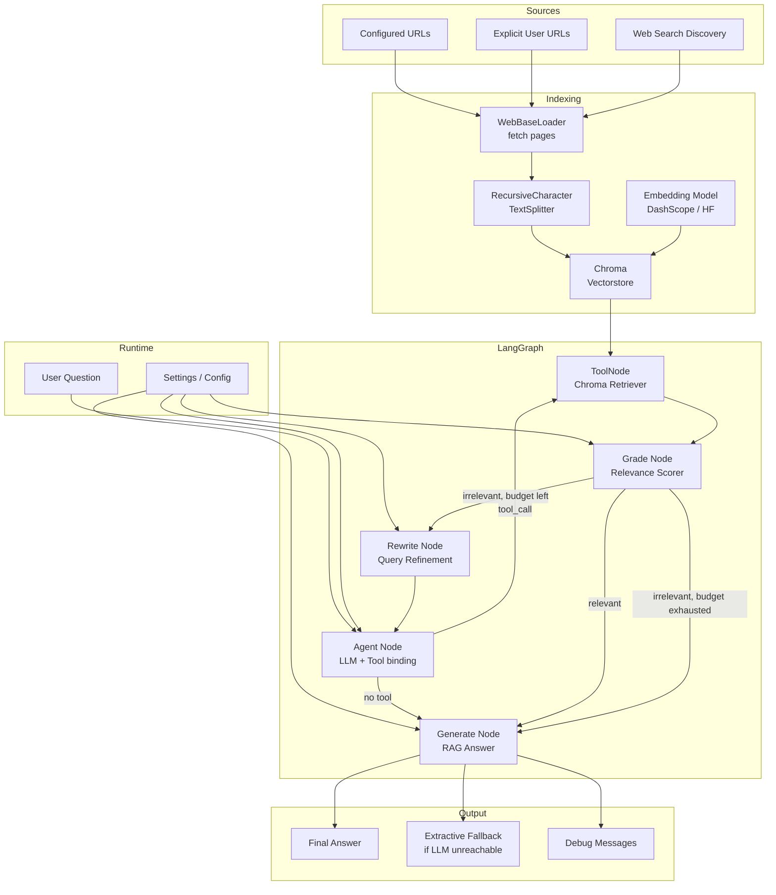
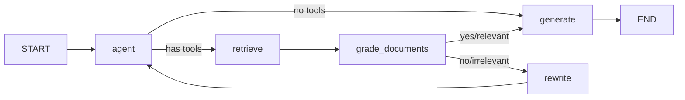
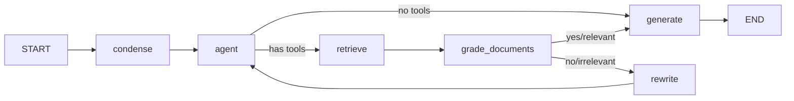
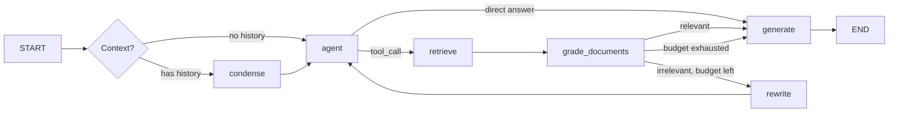
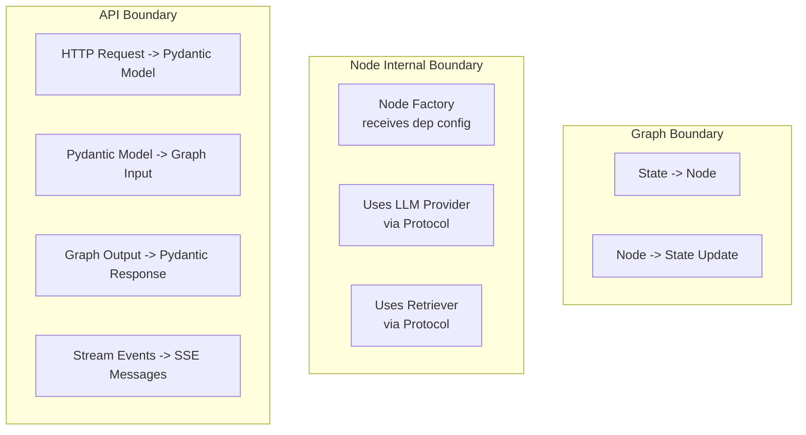
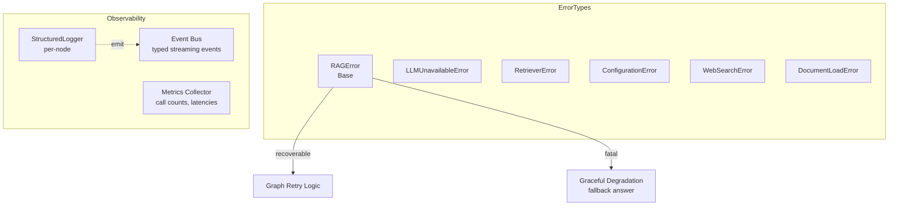
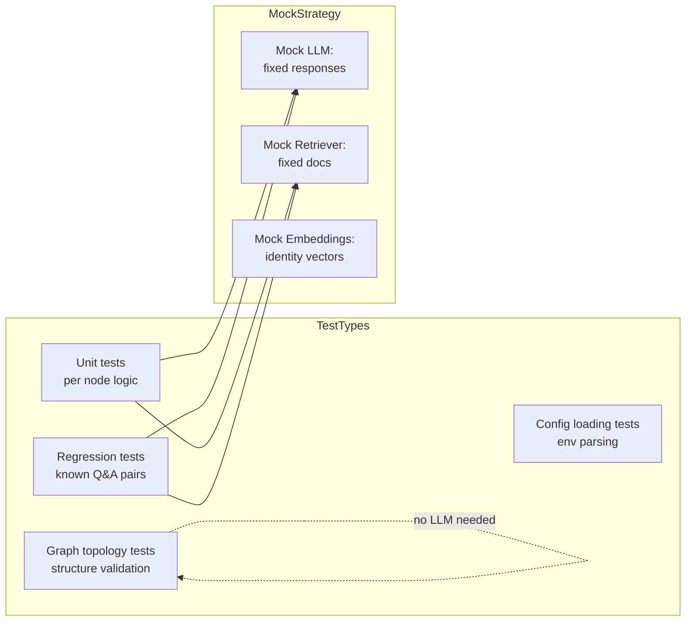

# LangGraph RAG Application -- Refactoring Plan

Generated: 2026-06-05
Target: `web-developed` branch at commit `1bdbd93`

---

## Table of Contents

1. [Existing System Analysis](#1-existing-system-analysis)
2. [Refactoring Goals and Principles](#2-refactoring-goals--principles)
3. [Proposed Architecture](#3-proposed-architecture)
4. [Complete Directory Structure](#4-complete-directory-structure)
5. [Data Model Design](#5-data-model-design)
6. [Interface Definitions](#6-interface-definitions)
7. [Refactoring Roadmap](#7-refactoring-roadmap)
8. [Deployment and Migration](#8-deployment--migration)

---

## 1. Existing System Analysis

### 1.1 Complete Directory Structure

```
E:\langgraph-rag\
├── .claude/
│   └── settings.local.json
├── .env.example
├── .gitignore
├── README.md
├── SSL_FIX.md
├── requirements.txt
└── src/
    ├── __init__.py
    ├── core/                          # Shared RAG engine
    │   ├── __init__.py
    │   ├── config.py                  # Settings dataclass + env loader
    │   ├── embeddings.py              # DashScope/HuggingFace embedding wrappers
    │   ├── state.py                   # AgentState TypedDict (messages + rewrite_count)
    │   ├── nodes.py                   # Graph node factories (agent, rewrite, grade, generate, retry logic, extractive fallback)
    │   ├── graph.py                   # StateGraph topology definition
    │   ├── graph_executor.py          # Convenience wrapper for graph.stream()
    │   ├── retriever.py               # Chroma vectorstore builder + retriever tool factory
    │   └── web_search.py              # Web search URL discovery (Baidu, DuckDuckGo)
    ├── qa/                            # Single-shot Q&A (port 8000)
    │   ├── __init__.py
    │   ├── api.py                     # FastAPI app, global _graph/_settings state
    │   ├── main.py                    # CLI entry point + arg parsing
    │   ├── draw_graph.py              # Graph visualization utility
    │   └── static/
    │       ├── index.html
    │       └── script.js
    └── chat/                          # Multi-turn chat (port 8001)
        ├── __init__.py
        ├── api.py                     # FastAPI app, per-session graph building
        ├── graph.py                   # Chat graph (condense node + MemorySaver)
        ├── main.py                    # CLI entry point + REPL
        ├── nodes.py                   # Chat-flavored node factories (duplicated from core/)
        ├── sessions.py                # In-memory ChatSessionRegistry
        ├── state.py                   # ChatState (extends AgentState with current_question)
        └── static/
            ├── index.html
            └── script.js
```

### 1.2 Core Component Breakdown

| Module | File | Primary Responsibility | Lines |
|--------|------|----------------------|-------|
| `core` | `config.py` | `Settings` frozen dataclass (42 fields), `load_settings()` from `.env`, side-effect env var injection | 198 |
| `core` | `state.py` | `AgentState` TypedDict (`messages`, `rewrite_count`) | 23 |
| `core` | `embeddings.py` | `DashScopeTextEmbeddings` (LangChain `Embeddings` impl), `build_embeddings()` factory, retry logic | 151 |
| `core` | `retriever.py` | Chroma vectorstore lifecycle, web doc loading, text splitting, `build_retriever()`, `build_retriever_tool()`, Windows file-lock retry | 294 |
| `core` | `web_search.py` | URL discovery via Baidu/DDG, noise filtering, `settings_for_discovered_urls()` | 363 |
| `core` | `nodes.py` | Four node factories (`agent`, `grade_documents`, `rewrite`, `generate`), retry logic, extractive fallback, SSL config, prompt templates, keyword match heuristic | 429 |
| `core` | `graph.py` | StateGraph assembly with 4 nodes + conditional edges | 53 |
| `core` | `graph_executor.py` | `run_rag_query()` convenience function wrapping `graph.stream()` | 108 |
| `qa` | `main.py` | CLI arg parser, `query`/`serve`/`rebuild` subcommands, web search integration | 225 |
| `qa` | `api.py` | FastAPI app, global state, URL parsing, rebuild locking, per-request graph rebuild logic | 337 |
| `qa` | `draw_graph.py` | Mermaid PNG export of the graph | 24 |
| `chat` | `state.py` | `ChatState` (adds `current_question`, `current_question_index`) | 33 |
| `chat` | `nodes.py` | Five node factories (adds `condense_question`), copies core/ node logic with `_question_from_state()` | 348 |
| `chat` | `graph.py` | Chat graph with `condense` + `MemorySaver` checkpointer | 93 |
| `chat` | `sessions.py` | `ChatSession` dataclass, `ChatSessionRegistry` thread-safe in-memory map | 94 |
| `chat` | `main.py` | CLI, `serve`/`chat` subcommands, REPL loop | 171 |
| `chat` | `api.py` | FastAPI app for chat, per-session graph building, 5 endpoints | 362 |

### 1.3 Existing Data Flow



### 1.4 Existing LangGraph Graph Structure



**Nodes:**
- `agent` -- LLM (ChatTongyi) with bound retriever tool; decides to call tool or answer directly
- `retrieve` -- ToolNode wrapping Chroma retriever
- `grade_documents` -- Structured output LLM grader (binary yes/no + explanation), with keyword fallback
- `rewrite` -- LLM rewrites the query for better retrieval
- `generate` -- RAG prompt + LLM + StrOutputParser

**Chat graph variation** (in `src/chat/graph.py`):

- Adds `condense` node at the start (standalone question rewriting for multi-turn context)
- Uses `MemorySaver` checkpointer for per-thread persistence
- Question resolution via `state["current_question"]` instead of `messages[0]`

### 1.5 External Dependencies

| Dependency | Purpose | Version Constraint |
|-----------|---------|-------------------|
| langchain / langchain-core | LLM framework, tooling, embeddings | >=0.3.0, <0.4 |
| langchain-community | ChatTongyi, WebBaseLoader, Chroma fallback | >=0.3.0, <0.4 |
| langchain-chroma | Chroma vectorstore integration | >=0.1.4, <0.3 |
| langchain-huggingface | HuggingFaceEmbeddings | >=0.1.0, <0.4 |
| langgraph | StateGraph, ToolNode, MemorySaver, message utilities | >=0.2.0, <0.7 |
| chromadb | Vector database | >=0.5.0, <0.7 |
| dashscope | Alibaba Tongyi / Qwen LLM + embeddings | >=1.20.0, <2 |
| fastapi | HTTP API server | >=0.110, <0.120 |
| uvicorn | ASGI server | >=0.27, <1 |
| pydantic | Data validation, request/response models | >=2.6, <3 |
| beautifulsoup4 | HTML parsing for web search | >=4.12, <5 |
| ddgs | DuckDuckGo search client | >=4.0, <10 |
| sentence-transformers | Local embedding models | >=2.2.0, <6 |
| tiktoken | Token counting for text splitting | >=0.7.0, <1 |

### 1.6 Current Limitations and Technical Debt

**Structural Issues:**

| # | Issue | Severity | Location |
|---|-------|----------|----------|
| 1 | **Near-duplicate node factories** in `chat/nodes.py` vs `core/nodes.py` -- 4 of 5 nodes are copy-pasted with only question resolution differing | Critical | `chat/nodes.py`, `core/nodes.py` |
| 2 | **Print-based logging** for graph node entry/exit (`print("---CALL AGENT---")`) instead of structured logging | High | All `*nodes.py` |
| 3 | **Global mutable state** in API modules (`_graph`, `_settings`, `_rebuild_lock`) | High | `qa/api.py`, `chat/api.py` |
| 4 | **Mixed concerns in config.py** -- `load_settings()` both reads config AND sets `os.environ` as side effect | High | `core/config.py` |
| 5 | **No formal streaming support** -- all graph execution is synchronous batch | High | All |
| 6 | **No test suite** -- zero test files exist | High | Missing `tests/` |
| 7 | **No typed error hierarchy** -- all errors are `RuntimeError` or bare `Exception` | Medium | All |
| 8 | **Duplicated URL parsing logic** in `qa/api.py` and `chat/api.py` | Medium | Both `api.py` |
| 9 | **No configuration file support** -- env vars only, no YAML/JSON | Medium | `core/config.py` |
| 10 | **Single-threaded rebuild lock** serializes all Chroma rebuilds globally | Medium | `qa/api.py` |
| 11 | **In-memory sessions only** -- chat sessions lost on server restart | Medium | `chat/sessions.py` |
| 12 | **Inconsistent web search provider patterns** -- DDGS uses library, Baidu uses raw HTTP | Low | `core/web_search.py` |
| 13 | **Windows-specific file lock code** in retriever adds platform complexity | Low | `core/retriever.py` |

**Design Debt:**

| # | Issue | Severity |
|---|-------|----------|
| 14 | Node factories capture `settings` as closures -- hard to unit test in isolation | High |
| 15 | No `Protocol` or `ABC` for retrievers, embeddings, LLMs -- adding a new provider requires modifying core files | Medium |
| 16 | `RAG_PROMPT` template embedded in `core/nodes.py` alongside generation logic | Medium |
| 17 | No separation between graph definition and node implementations | Medium |
| 18 | `graph_executor.py` duplicates logic that should live in the graph itself | Low |
| 19 | No event/message types for streaming -- consumers must parse raw dicts | Medium |
| 20 | Settings dataclass has 42 fields with no grouping/namespacing | Low |

---

## 2. Refactoring Goals and Principles

### 2.1 Primary Goals

1. **Eliminate code duplication** -- Unify `core/nodes.py` and `chat/nodes.py` into a single reusable node library.
2. **Improve modularity** -- Formal interfaces (Protocols) for retrievers, embeddings, LLMs. Each module has a single, well-defined responsibility.
3. **Add proper streaming support** -- SSE-based streaming of tokens and intermediate events from the graph.
4. **Establish a proper testing foundation** -- Unit tests for nodes, integration tests for graph topology.
5. **Replace print() with structured logging** -- Configurable logging throughout the graph pipeline.
6. **Eliminate global mutable state** -- Dependency injection for all API and graph components.
7. **Add typed event/streaming system** -- Well-defined event types for graph execution stages.
8. **Add configuration file support** -- YAML config files with env var overrides.

### 2.2 Non-Goals (Out of Scope)

- Changing the core business logic (the RAG pipeline itself, the LLM model choice, the retriever algorithm)
- Replacing LangGraph with another framework
- Changing the frontend UI (beyond what is necessary for streaming support)
- Adding authentication/authorization
- Horizontal scaling (multi-process graph execution)
- Changing the underlying vector database from Chroma
- Full CI/CD pipeline setup

### 2.3 Incremental Refactoring Phases

| Phase | Focus | Changes | Risk |
|-------|-------|---------|------|
| **Phase 1** | Extracting components without behavioral change | Unify node implementations, extract utility code, add structured logging, eliminate print(), add test harness | Low |
| **Phase 2** | Interface abstractions and improved architecture | Protocols for providers, dependency injection in APIs, typed event system, config file support | Medium |
| **Phase 3** | Streaming, observability, and optimizations | SSE streaming endpoints, metrics/tracing, session persistence, optimized rebuilds | Medium-High |

### 2.4 Backward Compatibility Guarantees

- All existing CLI commands continue to work (`python -m src.qa.main query`, `python -m src.qa.main serve`, etc.)
- All existing API endpoints maintain the same request/response schemas (Phase 1-2)
- The QA `/query` endpoint remains identical in contract through Phase 2
- The chat API endpoints (`/chat`, `/chat/{id}/message`, etc.) remain identical in contract through Phase 2
- `.env.example` settings remain valid with no required additions
- Existing Chroma databases remain compatible (no schema changes)
- New endpoints/features added in Phase 3 are additive only

---

## 3. Proposed Architecture

### 3.1 High-Level Architecture

```mermaid
flowchart TD
    subgraph Interfaces["Interfaces / Protocols"]
        I1[Retriever Protocol]
        I2[EmbeddingModel Protocol]
        I3[LLM Provider Protocol]
        I4[WebSearch Protocol]
    end

    subgraph Core["Core Engine"]
        C1[Config Manager\nYAML + env override]
        C2[Graph Builder\nTopology assembly]
        C3[Graph Executor\nStream + batch modes]
        C4[Event System\nTyped events/streaming]
    end

    subgraph Nodes["Graph Node Library"]
        N1[Agent Node]
        N2[Retrieve Node]
        N3[Grade Documents Node]
        N4[Rewrite Query Node]
        N5[Generate Answer Node]
        N6[Condense Question Node]
    end

    subgraph Providers["Provider Implementations"]
        P1[ChromaRetriever]
        P2[DashScopeEmbeddings]
        P3[ChatTongyi]
        P4[BaiduWebSearch]
        P5[DuckDuckGoWebSearch]
        P6[HuggingFaceEmbeddings]
    end

    subgraph Apps["Applications"]
        A1[QA App\nSingle-shot RAG]
        A2[Chat App\nMulti-turn RAG]
    end

    subgraph API["API Layer"]
        R1[QA Router\n/query, /health]
        R2[Chat Router\n/chat, /chat/{id}/*]
        R3[Stream Router\n/query/stream, /chat/{id}/stream]
    end

    I1 --> P1
    I2 --> P2
    I2 --> P6
    I3 --> P3
    I4 --> P4
    I4 --> P5

    P1 --> N2
    P3 --> N1
    P3 --> N3
    P3 --> N4
    P3 --> N5
    P3 --> N6

    C1 --> C2
    N1 --> C2
    N2 --> C2
    N3 --> C2
    N4 --> C2
    N5 --> C2
    N6 --> C2

    C2 --> C3
    C4 --> C3

    C3 --> A1
    C3 --> A2
    A1 --> R1
    A1 --> R3
    A2 --> R2
    A2 --> R3
```

### 3.2 Updated LangGraph Graph Structure

**Shared graph (used by both QA and Chat):**



The single graph definition supports both modes:
- **QA mode**: `condense` node becomes a no-op (no history)
- **Chat mode**: `condense` runs the standalone question rewrite
- **Checkpointer**: `None` for QA, `MemorySaver` for chat

### 3.3 Module Division with Clear Single Responsibilities

| Module | Responsibility | What it does NOT do |
|--------|---------------|-------------------|
| `config/` | Configuration loading + validation | Does not set `os.environ` as side effect |
| `graph/` | Graph topology assembly | Does not implement node logic |
| `graph/nodes.py` | Pure node factory functions | Does not contain prompts, retry logic, or provider setup |
| `graph/state.py` | State type definitions | Does not contain any business logic |
| `rag/retriever/` | Retriever interface + Chroma implementation | Does not know about LLMs or the graph |
| `rag/embeddings/` | Embedding interface + implementations | Does not know about vector stores |
| `rag/web_search/` | Web search interface + providers | Does not know about indexing or Chroma |
| `llm/` | LLM provider interface + DashScope impl | Does not contain prompt templates |
| `llm/prompts.py` | All prompt templates in one place | Does not contain invocation logic |
| `llm/retry.py` | Unified retry logic | Does not know about specific APIs |
| `api/` | FastAPI application + endpoints | Does not contain graph logic |
| `events/` | Typed event definitions for streaming | Does not contain transport logic |

### 3.4 Interface Boundaries



### 3.5 Error Handling and Observability



---

## 4. Complete Directory Structure

```
E:\langgraph-rag\
├── .claude/                                  [KEEP]
├── .env.example                              [KEEP]
├── .gitignore                                [KEEP]
├── README.md                                 [KEEP]  + update
├── SSL_FIX.md                                [KEEP]
├── requirements.txt                          [REFACTOR]  reorganize into groups
├── pyproject.toml                            [NEW]  project metadata + test config
├── REFACTORING_PLAN.md                       [NEW]  this document
│
├── src/
│   ├── __init__.py                           [KEEP]
│   │
│   ├── config/                               [NEW -- extract from core/config.py]
│   │   ├── __init__.py                       [NEW]
│   │   ├── settings.py                       [REFACTOR]  pure Settings dataclass (no env side effects)
│   │   ├── loader.py                         [REFACTOR]  YAML + env loading, no os.environ mutation
│   │   └── defaults.py                       [NEW]  default URL lists, constants
│   │
│   ├── graph/                                [REFACTOR -- unified from core/graph.py + chat/graph.py]
│   │   ├── __init__.py                       [NEW]
│   │   ├── state.py                          [REFACTOR]  unified state with QA and Chat views
│   │   ├── builder.py                        [REFACTOR]  graph assembly (takes providers, not settings)
│   │   ├── executor.py                       [REFACTOR]  graph run + stream wrappers
│   │   ├── nodes/                            [REFACTOR -- unified from core/nodes.py + chat/nodes.py]
│   │   │   ├── __init__.py                   [NEW]
│   │   │   ├── agent.py                      [REFACTOR]  no duplicate; parameterized question resolution
│   │   │   ├── condense.py                   [MOVE]  from chat/nodes.py
│   │   │   ├── grade.py                      [REFACTOR]  no duplicate
│   │   │   ├── rewrite.py                    [REFACTOR]  no duplicate
│   │   │   └── generate.py                   [REFACTOR]  no duplicate
│   │   └── edges.py                          [NEW]  conditional edge logic (grade decision)
│   │
│   ├── llm/                                  [NEW -- extract from core/nodes.py + core/embeddings.py]
│   │   ├── __init__.py                       [NEW]
│   │   ├── protocol.py                       [NEW]  LLM provider Protocol
│   │   ├── tongyi.py                         [REFACTOR]  ChatTongyi wrapper
│   │   ├── retry.py                          [REFACTOR]  unified retry logic
│   │   └── factory.py                        [NEW]  LLM provider factory
│   │
│   ├── rag/                                  [NEW -- extract from core/retriever.py + core/embeddings.py]
│   │   ├── __init__.py                       [NEW]
│   │   ├── retriever.py                      [NEW]  Retriever Protocol
│   │   ├── chroma_retriever.py               [REFACTOR]  Chroma-specific logic
│   │   ├── embeddings.py                     [NEW]  Embedding Protocol
│   │   ├── dashscope_embeddings.py           [MOVE]  from core/embeddings.py (DashScopeTextEmbeddings)
│   │   ├── hf_embeddings.py                  [MOVE]  from core/embeddings.py (HuggingFaceEmbeddings factory)
│   │   └── document_loader.py                [REFACTOR]  WebBaseLoader + text splitter, now separated
│   │
│   ├── web_search/                           [NEW -- extract from core/web_search.py]
│   │   ├── __init__.py                       [NEW]
│   │   ├── protocol.py                       [NEW]  WebSearch Provider Protocol
│   │   ├── baidu.py                          [MOVE]  from core/web_search.py
│   │   ├── duckduckgo.py                     [MOVE]  from core/web_search.py
│   │   └── factory.py                        [NEW]  provider selection + instantiation
│   │
│   ├── events/                               [NEW -- typed event system for streaming]
│   │   ├── __init__.py                       [NEW]
│   │   ├── types.py                          [NEW]  all event type definitions
│   │   └── emitter.py                        [NEW]  event bus / emitter
│   │
│   ├── api/                                  [NEW -- unify qa/ and chat/ API modules]
│   │   ├── __init__.py                       [NEW]
│   │   ├── dependencies.py                   [NEW]  FastAPI dependency injection
│   │   ├── routers/                          [NEW]
│   │   │   ├── __init__.py                   [NEW]
│   │   │   ├── qa.py                         [REFACTOR]  single-shot endpoints, no globals
│   │   │   ├── chat.py                       [REFACTOR]  multi-turn endpoints, no globals
│   │   │   └── stream.py                     [NEW]  SSE streaming endpoints
│   │   ├── models/                           [NEW]
│   │   │   ├── __init__.py                   [NEW]
│   │   │   ├── qa_models.py                  [REFACTOR]  QueryRequest, QueryResponse
│   │   │   └── chat_models.py                [REFACTOR]  all chat API models
│   │   └── static/                           [KEEP]  same HTML/JS, updated only for streaming
│   │       ├── qa/
│   │       │   ├── index.html                [MOVE]  from src/qa/static/index.html
│   │       │   └── script.js                 [MOVE]  from src/qa/static/script.js
│   │       └── chat/
│   │           ├── index.html                [MOVE]  from src/chat/static/index.html
│   │           └── script.js                 [MOVE]  from src/chat/static/script.js
│   │
│   ├── sessions/                             [NEW -- extract from chat/sessions.py]
│   │   ├── __init__.py                       [NEW]
│   │   ├── registry.py                       [REFACTOR]  ChatSessionRegistry with optional persistence
│   │   └── models.py                         [NEW]  ChatSession dataclass + storage model
│   │
│   ├── qa/                                   [DEPRECATE at end of Phase 3]
│   │   ├── __init__.py                       [KEEP]  re-export from new locations
│   │   ├── main.py                           [KEEP]  CLI compatibility shim
│   │   ├── api.py                            [REFACTOR]  thin wrapper calling new api.routers.qa
│   │   └── draw_graph.py                     [KEEP]
│   │
│   └── chat/                                 [DEPRECATE at end of Phase 3]
│       ├── __init__.py                       [KEEP]  re-export from new locations
│       ├── main.py                           [KEEP]  CLI compatibility shim
│       └── api.py                            [REFACTOR]  thin wrapper calling new api.routers.chat
│
├── tests/                                    [NEW]
│   ├── __init__.py                           [NEW]
│   ├── conftest.py                           [NEW]  fixtures: mock settings, mock LLM
│   ├── test_state.py                         [NEW]
│   ├── test_config.py                        [NEW]
│   ├── test_nodes/                           [NEW]
│   │   ├── __init__.py                       [NEW]
│   │   ├── test_agent.py                     [NEW]
│   │   ├── test_grade.py                     [NEW]
│   │   ├── test_rewrite.py                   [NEW]
│   │   ├── test_generate.py                  [NEW]
│   │   └── test_condense.py                  [NEW]
│   ├── test_graph.py                         [NEW]  graph topology tests
│   ├── test_retriever.py                     [NEW]
│   ├── test_embeddings.py                    [NEW]
│   ├── test_web_search.py                    [NEW]
│   ├── test_api/                             [NEW]
│   │   ├── __init__.py                       [NEW]
│   │   ├── test_qa_api.py                    [NEW]
│   │   └── test_chat_api.py                  [NEW]
│   └── integration/                          [NEW]
│       ├── __init__.py                       [NEW]
│       └── test_rag_pipeline.py              [NEW]
│
└── config/                                   [NEW]
    ├── default.yaml                          [NEW]  default configuration
    └── example.yaml                          [NEW]  annotated example config
```

**Change Summary by File Status:**

| Status | Count | Files |
|--------|-------|-------|
| `[KEEP]` | 15 | .env.example, .gitignore, README.md, SSL_FIX.md, .claude/, src/__init__.py, src/qa/__init__.py, src/qa/main.py, src/qa/draw_graph.py, src/chat/__init__.py, src/chat/main.py, existing static files, frontend JS/HTML |
| `[REFACTOR]` | 18 | requirements.txt, core/config.py (split), core/nodes.py (split), core/graph.py (moved), core/graph_executor.py (moved), core/retriever.py (split), core/state.py, core/embeddings.py (split), core/web_search.py (split), chat/nodes.py (merged into graph/nodes/), chat/graph.py (merged), chat/state.py (merged), chat/sessions.py (moved), chat/api.py, qa/api.py, web_search.py (split into protocol + providers) |
| `[MOVE]` | 12 | core/embeddings.py classes -> rag/, core/web_search.py providers -> web_search/, qa/static -> api/static/qa/, chat/static -> api/static/chat/, chat/sessions.py -> sessions/ |
| `[NEW]` | 50+ | pyproject.toml, config/*, graph/builder.py, graph/executor.py, graph/edges.py, graph/nodes/__init__.py, events/*, api/routers/*, api/dependencies.py, api/models/*, sessions/models.py, tests/*, config/yaml files |
| `[RENAME]` | 0 | None needed |

---

## 5. Data Model Design

### 5.1 Graph State (Unified)

```python
from __future__ import annotations

from typing import Annotated, Literal, Sequence

from langchain_core.messages import BaseMessage
from langgraph.graph.message import add_messages
from typing_extensions import TypedDict


class RAGState(TypedDict, total=False):
    """Unified graph state shared by QA and Chat modes.

    QA mode:
        messages[0] is the user question; no condense step needed.

    Chat mode:
        messages holds the full conversation history.
        ``current_question`` is the standalone form of the latest user turn
        (produced by the condense node).
        ``current_question_index`` indexes into messages for the raw user text.

    Mode-independent:
        ``rewrite_count`` caps the agent -> grade -> rewrite loop.
        ``source_urls`` records which URLs were used (for response metadata).
        ``source_mode`` tracks whether URLs were explicit, web-discovered, or defaults.
        ``errors`` collects non-fatal warnings that should be reported to the caller.
    """

    # Core message history (LangGraph-managed with add_messages reducer)
    messages: Annotated[Sequence[BaseMessage], add_messages]

    # Rewrite loop control
    rewrite_count: int
    max_rewrites: int  # pulled from settings, but state-owned so nodes are stateless

    # Chat-specific fields (optional; absent in QA mode)
    current_question: str
    current_question_index: int

    # Metadata (read-only after initial injection)
    source_urls: list[str]
    source_mode: Literal["explicit", "web_search", "defaults"]
    source_note: str | None

    # Observability
    errors: list[str]
```

### 5.2 Document Schema

```python
from __future__ import annotations

from dataclasses import dataclass, field
from datetime import datetime


@dataclass(frozen=True)
class SourceDocument:
    """A document loaded from a URL and split into chunks."""

    url: str
    title: str
    content: str
    chunk_index: int
    loaded_at: datetime = field(default_factory=datetime.utcnow)

    @property
    def char_count(self) -> int:
        return len(self.content)


@dataclass
class IndexingResult:
    """Result of indexing a set of source URLs."""

    total_docs: int
    total_chunks: int
    failed_urls: list[str]
    elapsed_seconds: float
    embedding_model: str
```

### 5.3 API Request/Response Models

```python
from __future__ import annotations

from pydantic import BaseModel, Field


# ---- QA Endpoints ----

class QueryRequest(BaseModel):
    question: str = Field(..., min_length=1)
    urls: str | list[str] | None = Field(None)
    web_search: bool = Field(True)
    rebuild: bool = Field(False)
    debug: bool = Field(False)


class QueryResponse(BaseModel):
    answer: str | None = Field(None)
    error: str | None = Field(None)
    success: bool = Field(True)
    messages: list[str] | None = Field(None)
    source_urls: list[str] | None = Field(None)
    source_mode: str | None = Field(None)
    source_note: str | None = Field(None)


# ---- Streaming Endpoints ----

class StreamEvent(BaseModel):
    """One event in a streaming response."""

    event: str = Field(
        ...,
        description="Event type: node_start | node_end | token | error | done",
    )
    node: str | None = Field(None, description="Name of the graph node")
    data: str | dict | None = Field(None, description="Event payload")


# ---- Chat Endpoints ----

class StartChatRequest(BaseModel):
    urls: str | list[str] | None = Field(None)
    web_search: bool = Field(True)
    seed_question: str | None = Field(None)


class StartChatResponse(BaseModel):
    thread_id: str
    source_urls: list[str]
    source_mode: str
    source_note: str | None = None


class MessageRequest(BaseModel):
    message: str = Field(..., min_length=1)


class MessageResponse(BaseModel):
    thread_id: str
    answer: str
    error: str | None = None


class HistoryTurn(BaseModel):
    role: str
    content: str


class HistoryResponse(BaseModel):
    thread_id: str
    turns: list[HistoryTurn]
    source_urls: list[str]
    source_mode: str
```

### 5.4 Configuration Models

```python
from __future__ import annotations

from pathlib import Path
from pydantic import BaseModel, Field


class DashScopeConfig(BaseModel):
    api_key: str
    model: str = "qwen-plus"
    request_timeout: int = 120
    max_retries: int = 3
    http_base_url: str = ""


class EmbeddingConfig(BaseModel):
    model: str = "text-embedding-v4"
    dimension: int | None = 1024
    batch_size: int = 10


class ChromaConfig(BaseModel):
    directory: Path = Path(".chroma")
    collection_name: str = "rag-chroma"


class WebSearchConfig(BaseModel):
    enabled: bool = True
    provider: str = "baidu"
    max_results: int = 20
    top_k: int = 3
    region: str = "wt-wt"
    timelimit: str | None = None
    verify_ssl: bool = True


class RAGConfig(BaseModel):
    source_urls: list[str] = Field(default_factory=list)
    chunk_size: int = 100
    chunk_overlap: int = 50
    min_keyword_matches: int = 2
    max_rewrites: int = 2
    allow_low_relevance_generate: bool = False
    web_search_enabled: bool = True
    page_load_timeout: int = 15


class AppConfig(BaseModel):
    """Top-level configuration, loadable from YAML or env vars."""

    dashscope: DashScopeConfig = Field(default_factory=DashScopeConfig)
    embedding: EmbeddingConfig = Field(default_factory=EmbeddingConfig)
    chroma: ChromaConfig = Field(default_factory=ChromaConfig)
    web_search: WebSearchConfig = Field(default_factory=WebSearchConfig)
    rag: RAGConfig = Field(default_factory=RAGConfig)

    api_host: str = "127.0.0.1"
    api_port: int = 8000

    class Config:
        env_prefix = "RAG_"
```

---

## 6. Interface Definitions

### 6.1 Retriever Protocol

```python
from __future__ import annotations

from typing import Protocol, runtime_checkable

from langchain_core.documents import Document
from langchain_core.tools import BaseTool


@runtime_checkable
class Retriever(Protocol):
    """Interface for all retrievers used by the RAG graph."""

    def retrieve(self, query: str, k: int = 4) -> list[Document]:
        """Retrieve the top-k most relevant documents for a query."""
        ...

    def as_tool(self) -> BaseTool:
        """Return a LangChain tool wrapping this retriever."""
        ...

    def rebuild(self, urls: list[str] | None = None) -> None:
        """Rebuild the index from scratch (for new source URLs)."""
        ...
```

### 6.2 Embedding Model Protocol

```python
from __future__ import annotations

from typing import Protocol, runtime_checkable


@runtime_checkable
class EmbeddingModel(Protocol):
    """Interface for embedding models."""

    model_name: str

    def embed_documents(self, texts: list[str]) -> list[list[float]]:
        """Embed a list of documents."""
        ...

    def embed_query(self, text: str) -> list[float]:
        """Embed a single query string."""
        ...
```

### 6.3 LLM Provider Protocol

```python
from __future__ import annotations

from typing import Any, Protocol, runtime_checkable

from langchain_core.language_models import BaseLanguageModel
from langchain_core.messages import BaseMessage
from langchain_core.runnables import Runnable


@runtime_checkable
class LLMProvider(Protocol):
    """Interface for LLM providers used in the graph."""

    def chat_model(self, **kwargs: Any) -> BaseLanguageModel:
        """Return a configured chat model."""
        ...

    def structured_model(
        self, output_schema: type, **kwargs: Any
    ) -> Runnable:
        """Return a model bound to structured output."""
        ...

    def invoke(self, model: Runnable, input_data: Any) -> BaseMessage:
        """Invoke with retry logic."""
        ...
```

### 6.4 Web Search Provider Protocol

```python
from __future__ import annotations

from typing import Protocol, runtime_checkable


@runtime_checkable
class WebSearchProvider(Protocol):
    """Interface for web search providers."""

    def search(self, query: str, max_results: int = 20) -> list[str]:
        """Search the web for URLs relevant to the query."""
        ...

    @property
    def provider_name(self) -> str:
        """Human-readable provider name (e.g., 'duckduckgo', 'baidu')."""
        ...
```

### 6.5 Graph Node Interface (Internal)

```python
from __future__ import annotations

from typing import Any, Callable, Protocol

from src.graph.state import RAGState


class GraphNode(Protocol):
    """A callable that takes state and returns state updates."""

    def __call__(self, state: RAGState) -> dict[str, Any]:
        ...


class ConditionalEdge(Protocol):
    """A callable that returns the next node name."""

    def __call__(self, state: RAGState) -> str:
        ...
```

### 6.6 Event Types for Streaming

```python
from __future__ import annotations

from dataclasses import dataclass, field
from datetime import datetime
from typing import Any


@dataclass(frozen=True)
class GraphEvent:
    """Base event emitted during graph execution."""

    type: str
    node: str | None
    timestamp: datetime = field(default_factory=datetime.utcnow)
    data: Any = None


@dataclass(frozen=True)
class NodeStartEvent(GraphEvent):
    type: str = "node_start"


@dataclass(frozen=True)
class NodeEndEvent(GraphEvent):
    type: str = "node_end"
    output: dict[str, Any] | None = None


@dataclass(frozen=True)
class TokenEvent(GraphEvent):
    """Emitted for each token during LLM generation."""

    type: str = "token"
    token: str = ""


@dataclass(frozen=True)
class RetrieverResultEvent(GraphEvent):
    type: str = "retriever_result"
    num_docs: int = 0
    sources: list[str] = field(default_factory=list)


@dataclass(frozen=True)
class GraderDecisionEvent(GraphEvent):
    type: str = "grader_decision"
    score: str = ""
    explanation: str = ""
    rewrite_count: int = 0


@dataclass(frozen=True)
class ErrorEvent(GraphEvent):
    type: str = "error"
    message: str = ""
    recoverable: bool = True


@dataclass(frozen=True)
class DoneEvent(GraphEvent):
    type: str = "done"
    answer: str = ""
```

### 6.7 Error Types and Codes

```python
from __future__ import annotations


class RAGError(Exception):
    """Base exception for all RAG-related errors."""

    code: str = "RAG_ERROR"

    def __init__(self, message: str, code: str | None = None) -> None:
        super().__init__(message)
        if code:
            self.code = code


class ConfigurationError(RAGError):
    code = "CONFIGURATION_ERROR"


class LLMUnavailableError(RAGError):
    code = "LLM_UNAVAILABLE"


class RetrieverError(RAGError):
    code = "RETRIEVER_ERROR"


class WebSearchError(RAGError):
    code = "WEB_SEARCH_ERROR"


class DocumentLoadError(RAGError):
    code = "DOCUMENT_LOAD_ERROR"


class AllSourcesFailedError(RAGError):
    code = "ALL_SOURCES_FAILED"
```

---

## 7. Refactoring Roadmap

### Phase 1: Extract Components Without Changing Behavior

**Goal:** Structural cleanup with zero behavioral change. Preserve every function signature, return value, and graph topology.

**Estimated effort:** 3-5 days

#### Step 1.1: Add test harness (Day 1)

- Create `tests/` directory structure
- Add `pyproject.toml` with `pytest` configuration
- Create `tests/conftest.py` with fixtures for mock settings, mock LLM, mock retriever
- Write snapshot tests for the existing QA and chat graph topologies (no LLM calls)
- Write tests for `config.py` Settings loading and env parsing
- **Verify:** `pytest --coverage` runs and existing code paths are exercised

#### Step 1.2: Extract and centralize retry logic (Day 1-2)

- Move `_invoke_with_retry` from `core/nodes.py` to a new shared module `src/utils/retry.py`
- Move SSL configuration logic to `src/utils/networking.py`
- Keep all existing module imports working via `__init__.py` re-exports
- **Verify:** All existing CLI commands produce identical output

#### Step 1.3: Replace print() with structured logging (Day 2)

- Add `logging.getLogger(__name__)` to every module (some already have it)
- Replace all `print("---CALL AGENT---")` with `logger.info("CALL AGENT")`
- Replace all `print("---DECISION: ...")` with `logger.info(...)`
- Add a configurable log level via settings
- **Verify:** Graph execution produces equivalent console output via logging

#### Step 1.4: Split settings from env-side-effect code (Day 2-3)

- Create `src/config/settings.py` with pure `Settings` dataclass (no env reading)
- Create `src/config/loader.py` with `load_settings()` that reads env and returns Settings
- Move helper functions (`_parse_urls`, `_parse_optional_int`, etc.) into `loader.py`
- Remove `os.environ` mutations from `load_settings()`; inject into dedicated env setter module
- **Verify:** `load_settings()` returns identical Settings objects

#### Step 1.5: Unify the two node libraries (Day 3-4)

- Create `src/graph/nodes/` directory
- Extract common node logic into a base implementation: `agent`, `grade_documents`, `rewrite`, `generate`
- Parameterize question resolution: inject a `question_resolver: Callable[[RAGState], str]` into each node factory
- For QA: resolver reads `messages[0]`
- For Chat: resolver reads `current_question` fallback to `messages[current_question_index]`
- `core/nodes.py` becomes a thin shim that calls the unified nodes with QA resolver
- `chat/nodes.py` becomes a thin shim that calls the unified nodes with Chat resolver
- **Verify:** Both QA and chat modes produce identical answers to test queries

#### Step 1.6: Extract prompt templates (Day 4)

- Move `RAG_PROMPT`, `CONDENSE_PROMPT`, grade prompt template into `src/llm/prompts.py`
- Import from shared location in both node implementations
- **Verify:** No change in generated prompt content (test with frozen LLM)

#### Step 1.7: Consolidate URL parsing (Day 4-5)

- Extract URL parsing helpers from `qa/api.py` and `chat/api.py` into `src/utils/urls.py`
- Replace both implementations with the shared version
- **Verify:** Both APIs handle edge cases (null, empty string, list, CSV string) identically

#### Testing Strategy for Phase 1:



**Phase 1 Exit Criteria:**
- All existing CLI commands produce identical output to the baseline
- `pytest` passes with >80% coverage on extracted modules
- No `print()` statements remain in graph node code
- Zero behavioral changes in graph execution

---

### Phase 2: Improve Interfaces and Add Abstractions

**Goal:** Formal interfaces, dependency injection, typed events, configuration file support.

**Estimated effort:** 5-8 days

#### Step 2.1: Add Provider Protocols (Day 1-2)

- Define `Retriever`, `EmbeddingModel`, `LLMProvider`, `WebSearchProvider` Protocols (as specified in Section 6)
- Implement `ChromaRetriever` class wrapping the existing `build_retriever()` logic
- Implement `DashScopeLLMProvider` wrapping `_new_chat_model()` and `_invoke_with_retry()`
- Implement `BaiduWebSearch` and `DuckDuckGoWebSearch` as Protocol implementations
- Refactor `build_retriever_tool()` to work with the `Retriever` Protocol
- **Verify:** All existing functionality works through Protocol interface

#### Step 2.2: Dependency injection in graph builder (Day 2-3)

- Change `builder.py` to accept `(retriever: Retriever, llm: LLMProvider, config: RAGConfig)` instead of `(settings: Settings)`
- Node factories receive only the dependencies they need (not the full Settings object)
- `Settings` is used only at the app entry point to configure providers
- Graph assembly becomes environment-agnostic
- **Verify:** Graph can be constructed with entirely mock providers

#### Step 2.3: Remove global mutable state from API modules (Day 3-4)

- Create `src/api/dependencies.py` with FastAPI dependency functions
- Use `fastapi.Depends()` to inject graph instances, session registries, config
- Replace module-level `_graph` with `request.app.state.graph`
- Replace `_settings` with `request.app.state.config`
- Replace `_rebuild_lock` with per-app lock in `app.state`
- Chat API: use dependency injection for `ChatSessionRegistry`
- **Verify:** Multiple test requests can be served without shared state pollution

#### Step 2.4: Add typed event system (Day 4-5)

- Implement all event types from Section 6.6
- Create event emitter that collects events from graph node callbacks
- Add `graph/executor.py` with two modes:
  - `run()` -- synchronous execution returning final state (current behavior)
  - `stream()` -- async generator yielding `GraphEvent` instances
- Wire event emission into node wrappers (non-invasive: callbacks passed via config)
- **Verify:** `stream()` produces expected event sequences for known queries

#### Step 2.5: Add YAML configuration support (Day 5-6)

- Create `config/default.yaml` with all current default values
- Create `config/loader.py` with load priority: CLI args > env vars > YAML file > defaults
- Implement `AppConfig` Pydantic model (from Section 5.4)
- Support `--config` CLI flag for custom config paths
- Keep backward compatibility with `.env`-only usage
- **Verify:** Both `.env` and `config.yaml` produce equivalent Settings

#### Step 2.6: Add error type hierarchy (Day 6)

- Implement all error types from Section 6.7
- Replace `raise RuntimeError(...)` with specific error types throughout the codebase
- Add error handlers in FastAPI apps that map error codes to HTTP status codes
- **Verify:** Error responses include meaningful error codes

#### Step 2.7: Consolidate graph into single builder (Day 6-8)

- Merge `core/graph.py` and `chat/graph.py` into `graph/builder.py`
- Single `build_graph()` accepts:
  - `mode: Literal["qa", "chat"]` -- controls condense node inclusion + checkpointer
  - `providers` -- dependency-injected providers
  - `config` -- RAGConfig
- Remove `src/core/graph.py` and `src/chat/graph.py`; replace with shims that call the shared builder
- **Verify:** Both QA and chat graphs have identical structure to before

#### Testing Strategy for Phase 2:

- Protocol conformance tests: verify each implementation satisfies its Protocol
- Dependency injection tests: graph works with mock providers
- API tests with `TestClient`: no shared state between requests
- Event system tests: verify event ordering and content
- Config loading tests: YAML + env + CLI override precedence

**Phase 2 Exit Criteria:**
- All provider implementations satisfy their Protocols (verified with `isinstance(impl, Protocol)`)
- FastAPI TestClient tests pass with zero mutable state issues
- Graph can be built entirely from mock providers
- `stream()` mode produces typed event sequences
- YAML configuration loads and merges correctly with env vars
- Error responses include typed error codes

---

### Phase 3: Add New Features and Optimizations

**Goal:** SSE streaming, session persistence, metrics, optimized Chroma rebuilds.

**Estimated effort:** 5-7 days

#### Step 3.1: SSE streaming endpoints (Day 1-2)

- Add `POST /query/stream` endpoint in `api/routers/stream.py`
- Add `POST /chat/{thread_id}/message/stream` endpoint
- Use `fastapi.responses.StreamingResponse` with `text/event-stream`
- Emit `StreamEvent` (from Section 5.3) for each graph event:
  - `event: node_start` when a graph node begins execution
  - `event: token` for each token emitted during generation
  - `event: node_end` with node output summary
  - `event: done` with the final answer
- Frontend JS updated (in `api/static/`) to consume SSE for real-time token display
- **Verify:** Browser shows tokens appearing in real-time during generation

#### Step 3.2: Session persistence (Day 2-3)

- Add optional `StorageBackend` Protocol for session persistence
- Implement `InMemoryStorage` (current behavior, default)
- Implement `SQLiteStorage` using `sqlite3` or `aiosqlite`
- Sessions table schema:
  ```sql
  CREATE TABLE sessions (
      thread_id TEXT PRIMARY KEY,
      source_urls TEXT NOT NULL,
      source_mode TEXT NOT NULL,
      config TEXT NOT NULL,
      created_at REAL NOT NULL,
      checkpoint BLOB
  );
  ```
- LangGraph checkpointer integration: persist to SQLite instead of `MemorySaver`
- Session recovery: restore active sessions on server restart
- **Verify:** Server restart preserves active chat sessions

#### Step 3.3: Metrics and basic observability (Day 3-5)

- Add a `MetricsCollector` that tracks:
  - Per-node call counts and latency histograms
  - Retriever query count and average docs returned
  - Grade distribution (relevant vs irrelevant)
  - Rewrite count distribution
  - Token usage per query
- Expose metrics via `GET /metrics` endpoint (prometheus format or JSON)
- Add optional LangSmith integration for full tracing (already partially wired)
- **Verify:** Metrics endpoint returns meaningful data after a few queries

#### Step 3.4: Optimized vectorstore rebuilds (Day 5-6)

- Current behavior: rebuild deletes entire Chroma store and re-indexes everything
- Improved: incremental update when only URLs are added (keep existing, index new)
- Use URL-chunk hash map to detect which URLs were already indexed
- Keep `_embedding_config_matches` check (already works well)
- Add progress bars for long indexing operations (CLI only)
- **Verify:** Adding one URL to existing store takes seconds, not minutes

#### Step 3.5: Deprecation shims and migration (Day 6-7)

- `src/core/` module becomes a pure re-export shim:
  ```python
  # src/core/graph.py
  from src.graph.builder import build_graph
  __all__ = ["build_graph"]
  ```
- `src/qa/` and `src/chat/` APIs become thin wrappers calling `src/api/routers/`
- Add deprecation warning to `src/core/` imports: `warnings.warn("Import from src.graph.X instead", DeprecationWarning)`
- Update `README.md` with new import paths and module structure
- **Verify:** Old import paths emit deprecation warnings but still work

#### Testing Strategy for Phase 3:

- SSE endpoint tests: `TestClient` with `stream=True`, verify event SSE format
- Session persistence tests: restart server, verify sessions restored
- Metrics tests: verify counter increments match expected counts
- Incremental index tests: verify only new URLs are processed
- Deprecation warning tests: verify old imports emit warnings

**Phase 3 Exit Criteria:**
- Real-time token streaming works in browser
- Chat sessions survive server restart (with SQLite backend)
- Metrics endpoint provides useful observability data
- Incremental indexing is functional
- All old import paths emit deprecation warnings but remain functional
- README.md updated with new project structure

---

## 8. Deployment and Migration

### 8.1 Backward Compatibility

| Aspect | Phase 1 | Phase 2 | Phase 3 |
|--------|---------|---------|---------|
| CLI commands | Identical | Identical | Identical (deprecation warnings) |
| API endpoints | Identical | Identical | New endpoints added (old kept) |
| Import paths | Identical | Identical | Deprecation warnings |
| Data formats | Identical | Identical | Identical |
| Config files | .env only | .env + YAML | Same |
| Chroma DB | Compatible | Compatible | Compatible |

### 8.2 Configuration Migration

**From (env-only):**
```bash
DASHSCOPE_API_KEY=sk-xxx
QWEN_MODEL=qwen-plus
EMBEDDING_MODEL=text-embedding-v4
```

**To (YAML + env override, Phase 2+):**
```yaml
# config/default.yaml
dashscope:
  model: qwen-plus
embedding:
  model: text-embedding-v4
  dimension: 1024
```

With `DASHSCOPE_API_KEY` still read from `.env` (secrets never in YAML).

Migration is automated: if no `config.yaml` exists, the loader falls back to `.env`-only mode. No action required from existing users.

### 8.3 Deployment Architecture

**Current:**
```
User -> FastAPI (single process) -> LangGraph -> Chroma (SQLite on disk)
                                                    -> DashScope API
```

**Phase 3 (no infrastructure changes):**
```
User -> FastAPI (single process) -> LangGraph -> Chroma (SQLite on disk)
                                                    -> DashScope API
                                  -> Event Bus (in-process)
                                  -> Metrics (in-process)
                                  -> Session Store (in-memory or SQLite)
```

No infrastructure changes required. All improvements are in-process. If horizontal scaling is needed later, Chroma can be replaced with a network vector database (Pinecone, Milvus, Qdrant) via the `Retriever` Protocol without changing the graph.

### 8.4 Monitoring and Logging Improvements

| Aspect | Current | Phase 1 | Phase 2 | Phase 3 |
|--------|---------|---------|---------|---------|
| Logging | `print()` + ad-hoc | `logging` module everywhere | Structured JSON logs | Same |
| Error tracking | RuntimeError | RuntimeError | Typed error hierarchy | Same + error codes |
| Tracing | LangSmith (env var) | Same | Same | Same + internal metrics |
| Metrics | None | None | None | /metrics endpoint |
| Streaming | None | None | Typed events | SSE transport |

### 8.5 Rollback Strategy

Each phase is a separate branch that merges into `main`:

1. **Phase 1 branch:** `refactor/phase-1-extract`
2. **Phase 2 branch:** `refactor/phase-2-interfaces` (based on phase-1)
3. **Phase 3 branch:** `refactor/phase-3-streaming` (based on phase-2)

Rollback at any point: `git revert <merge-commit>`. The compatibility shims mean old code paths are preserved through the end of Phase 3.

### 8.6 Risk Matrix

| Risk | Likelihood | Impact | Mitigation |
|------|-----------|--------|------------|
| Behavioral regression in node unification | Medium | High | Comprehensive snapshot tests before refactoring; test with frozen LLM responses |
| Windows file-lock issue during Chroma rebuild | Medium | Medium | Keep `_rmtree_with_retry` untouched until streaming phase; verify on Windows CI |
| SSE streaming breaks existing clients | Low | Medium | New endpoints only; old POST endpoints remain unchanged |
| Config YAML parser misses edge case | Low | Medium | Fail back to env-only mode; comprehensive parsing tests |
| Session SQLite schema needs migration later | Low | Low | Versioned schema with migration support |

---

## Appendix: File Change Summary Table

| File | Status | Phase | Action |
|------|--------|-------|--------|
| `requirements.txt` | REFACTOR | 1 | Regroup into dependency categories |
| `pyproject.toml` | NEW | 1 | Add project metadata + pytest config |
| `src/core/config.py` | REFACTOR | 1 | Split into config/settings.py + config/loader.py |
| `src/core/state.py` | REFACTOR | 1 | Consolidate into graph/state.py |
| `src/core/nodes.py` | REFACTOR | 1 | Split into graph/nodes/*.py; keep as shim |
| `src/core/graph.py` | REFACTOR | 2 | Merge into graph/builder.py; keep as shim |
| `src/core/graph_executor.py` | REFACTOR | 2 | Move to graph/executor.py |
| `src/core/retriever.py` | REFACTOR | 2 | Split into rag/chroma_retriever.py + rag/document_loader.py |
| `src/core/embeddings.py` | REFACTOR | 2 | Split into rag/dashscope_embeddings.py + rag/hf_embeddings.py |
| `src/core/web_search.py` | REFACTOR | 2 | Split into web_search/ providers |
| `src/qa/api.py` | REFACTOR | 2 | Remove globals; delegate to api/routers/ |
| `src/qa/main.py` | KEEP | - | Continue working |
| `src/chat/api.py` | REFACTOR | 2 | Remove globals; delegate to api/routers/ |
| `src/chat/main.py` | KEEP | - | Continue working |
| `src/chat/nodes.py` | REFACTOR | 1 | Merge into graph/nodes/; keep as shim |
| `src/chat/graph.py` | REFACTOR | 2 | Merge into graph/builder.py; keep as shim |
| `src/chat/sessions.py` | REFACTOR | 2 | Move to sessions/registry.py |
| `src/chat/state.py` | REFACTOR | 1 | Merge into graph/state.py |
| `src/graph/` (new) | NEW | 1-2 | Central graph architecture |
| `src/llm/` (new) | NEW | 1-2 | LLM abstractions and prompts |
| `src/rag/` (new) | NEW | 2 | RAG provider implementations |
| `src/web_search/` (new) | NEW | 2 | Web search providers |
| `src/events/` (new) | NEW | 2 | Typed event system |
| `src/api/` (new) | NEW | 2-3 | Restructured API layer |
| `src/sessions/` (new) | NEW | 2-3 | Session registry + persistence |
| `src/config/` (new) | NEW | 1-2 | Configuration management |
| `src/utils/` (new) | NEW | 1 | Shared utilities (retry, URLs, networking) |
| `tests/` (new) | NEW | 1 | Test suite |
| `config/` (new) | NEW | 2 | YAML configuration files |
