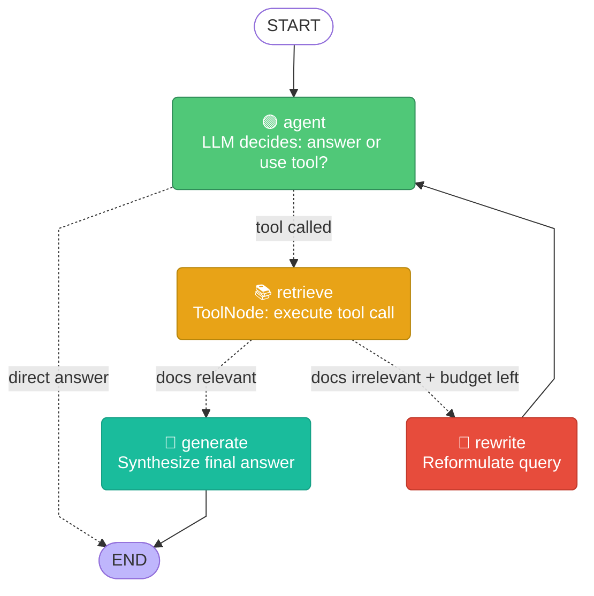
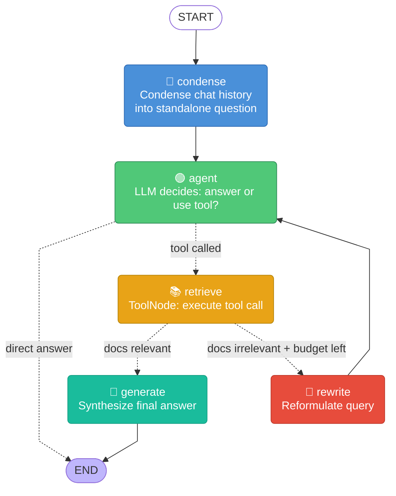
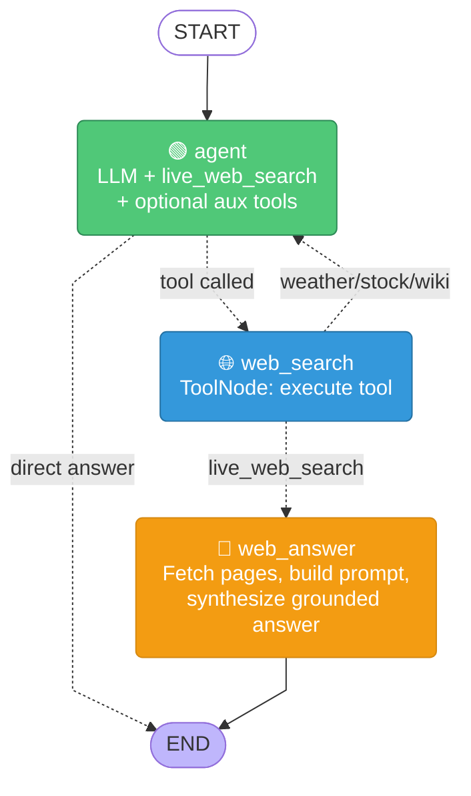
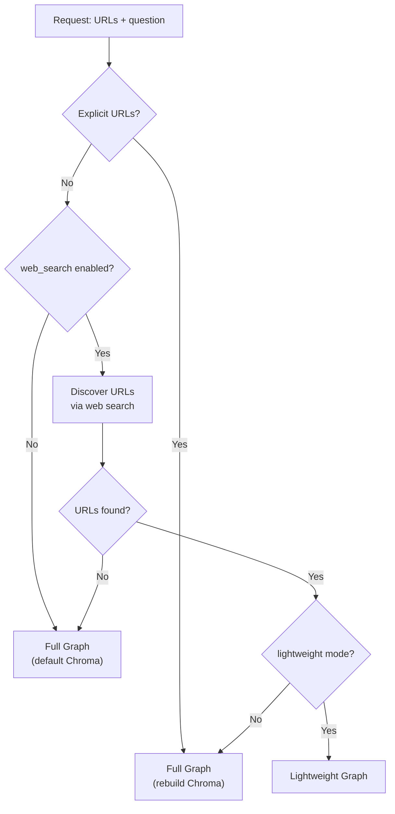

# LangGraph RAG — Node Graphs

## Full RAG Graph

**Flow:** `START → agent → retrieve → generate → END` (with `rewrite → agent` loop)

---

## Full RAG Graph — Chat Mode

**Flow:** `START → condense → agent → retrieve → generate → END` (with `rewrite → agent` loop)

---

## Lightweight Web-Search Graph

**Flow:** `START → agent → web_search → web_answer → END`

---

## Graph Selection Decision Tree

---

## Node Summary

| Node | Full Graph | Lightweight | Role |
|------|:----------:|:-----------:|------|
| `condense` | ✅ (chat) | ❌ | Rewrite multi-turn chat into standalone question |
| `agent` | ✅ | ✅ | LLM reasons and decides: answer directly or call tool |
| `retrieve` | ✅ | ❌ | Execute tool (Chroma search → return docs) |
| `grade` | ✅ | ❌ | LLM grades doc relevance → route to generate or rewrite |
| `rewrite` | ✅ | ❌ | LLM reformulates query when docs are irrelevant |
| `generate` | ✅ | ❌ | LLM synthesizes answer from retrieved context |
| `web_search` | ❌ | ✅ | Execute live_web_search tool → return URLs |
| `web_answer` | ❌ | ✅ | Fetch pages, build grounded prompt, synthesize |

## Edge Summary

| From | To | Graph | Condition |
|------|----|-------|-----------|
| `START` | `condense` | Full | Always |
| `START` | `agent` | Lightweight | No condense node |
| `condense` | `agent` | Full | Always |
| `agent` | `retrieve` | Full | Agent called a tool |
| `agent` | `END` | Both | Agent answered directly |
| `agent` | `web_search` | Lightweight | Agent called a tool |
| `retrieve` | `generate` | Full | Grade says docs are relevant |
| `retrieve` | `rewrite` | Full | Grade says docs NOT relevant |
| `rewrite` | `agent` | Full | Always (loop back) |
| `generate` | `END` | Full | Always |
| `web_search` | `web_answer` | Lightweight | Tool was `live_web_search` |
| `web_search` | `agent` | Lightweight | Tool was other (weather/stock/wiki) |
| `web_answer` | `END` | Lightweight | Always |
