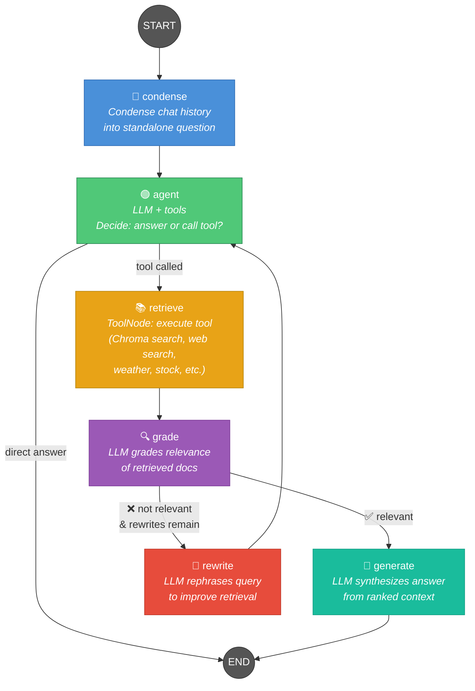
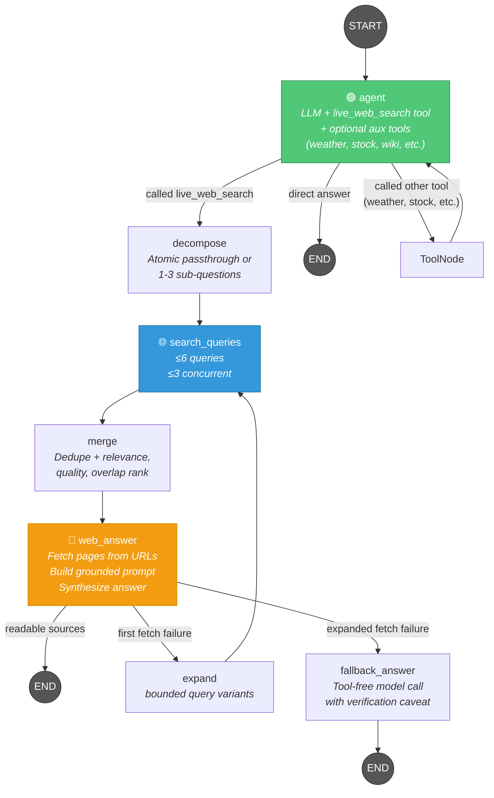
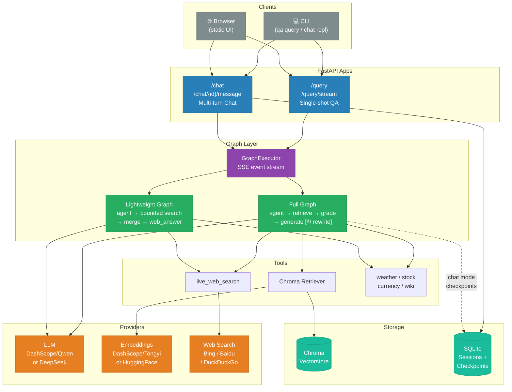
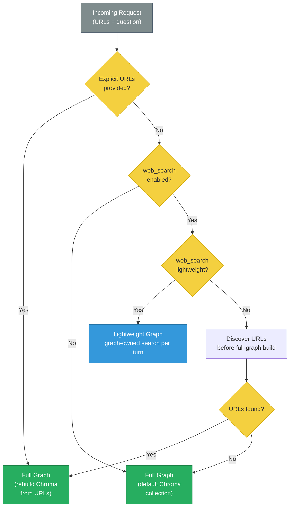
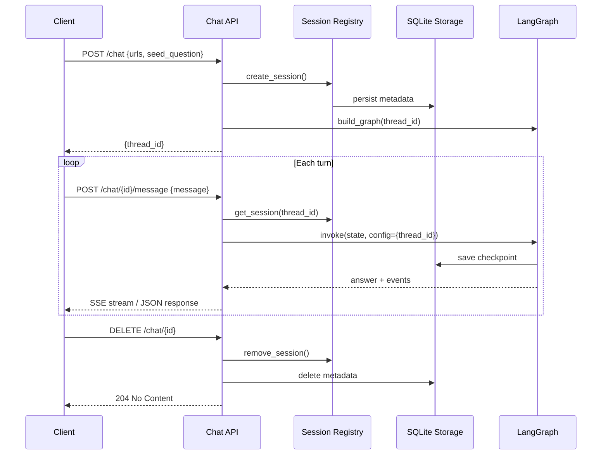

# LangGraph RAG — Workflow Diagrams

## 1. Full RAG Graph (`build_graph`)

Used for **chat** with Chroma vectorstore retrieval, document grading, and query rewriting.



### Execution Path
```
START → condense → agent → retrieve → grade → generate → END
                      ↑                    |
                      +—— rewrite ←———————+
```

### Edge Routing Logic

| Edge | Condition | Map |
|------|-----------|-----|
| `agent` → `retrieve` | Agent called a tool | `tools_condition()` → `"tools"` |
| `agent` → `END` | Agent answered directly | `tools_condition()` → `END` |
| `grade` → `generate` | Docs relevant OR rewrite budget exhausted | `GRADE_EDGE_MAP["generate"]` |
| `grade` → `rewrite` | Docs not relevant + budget remains | `GRADE_EDGE_MAP["rewrite"]` |
| `rewrite` → `agent` | Always (fixed edge) | — |

### Rewrite Loop
The `rewrite_count` in `RAGState` limits rewrites (default `max_rewrites=1`).
When the budget is exhausted, the graph forces `grade → generate` even if documents
are low-quality. The `allow_low_relevance_generate` setting also gates this.

---

## 2. Lightweight Graph (`build_lightweight_graph`)

Used when **web_search_lightweight** is enabled. In chat mode the compiled graph
owns discovery; the API does not search or rebuild the graph before each turn.
Skips Chroma, embeddings, grading, and the full-graph retrieval rewrite loop.
Provider-query LLM rewriting remains an optional, disabled-by-default setting.



### Edge Routing Logic

| Edge | Condition | Map |
|------|-----------|-----|
| `agent` → `decompose` | Agent called only `live_web_search` | `route_after_lightweight_agent()` → `"decompose"` |
| `agent` → `END` | Agent answered directly | `LIGHTWEIGHT_AGENT_EDGE_MAP[END]` |
| `agent` → `web_search` | Agent called another or multiple tools | `route_after_lightweight_agent()` → `"web_search"` |
| `decompose` → `search_queries` | Fixed edge | bounded provider fan-out |
| `search_queries` → `merge` → `web_answer` | Fixed edges | relevance-aware rank, fetch, synthesize |
| `web_search` → `agent` | Tool was weather/stock/wiki/etc. | `route_after_lightweight_tool()` → `"agent"` |
| `web_answer` → `expand` | First attempt has no readable, relevant source | one bounded expanded retry |
| `web_answer` → `fallback_answer` | Expanded retry also fails | one tool-free fallback call |
| `fallback_answer` → `END` | Always (fixed edge) | prevents another tool/search loop |

The graph owns the entire lightweight chat search. It runs at most six distinct
queries with at most three provider calls in flight, then merges provider
title/snippet relevance and URL quality before overlap and provider rank. There
are exactly two search/fetch attempts: the original batch and one expanded
batch. Deterministic query cleanup is the default; optional LLM query rewriting
is enabled only by `WEB_SEARCH_LLM_QUERY_REWRITE_ENABLED=true`.

Ordinary queries try the configured provider first, followed by any missing
providers in Bing → Baidu → DuckDuckGo order. Predominantly Chinese queries
prefer Baidu → Bing → DuckDuckGo.

### Auxiliary Tool Loop
When the agent calls a non-web-search tool (weather, stock, currency, Wikipedia), the
output routes back to `agent` so the LLM sees the structured result and synthesizes
a final answer. The `web_answer` node is only used for web page grounding.

---

## 3. System Architecture Overview



---

## 4. Tool Binding Matrix

Which tools are bound to the agent in each graph:

| Tool | Full Graph | Lightweight Graph | Requires Flag |
|------|:----------:|:-----------------:|:-------------:|
| Chroma Retriever | ✅ | ❌ | — |
| `live_web_search` | ✅ | ✅ | `web_search_enabled` |
| `get_weather` | ✅ | ✅ | `weather_enabled` |
| `get_stock_quote` | ✅ | ✅ | `stock_enabled` |
| `convert_currency` | ✅ | ✅ | `currency_enabled` |
| `search_wikipedia` | ✅ | ✅ | `wikipedia_enabled` |

---

## 5. Chat Graph Selection Logic



Lightweight chat does not perform a preliminary provider search. It compiles
the graph once, searches only after the agent calls `live_web_search`, and
persists the resulting source URLs without rebuilding Chroma or the graph.

---

## 6. Chat Session Lifecycle



The checkpoint retains the full transcript for `/history` and restart recovery.
Only the recent projection sent to model calls is bounded by
`CHAT_CONTEXT_MAX_TURNS` and `CHAT_CONTEXT_MAX_CHARS`.
