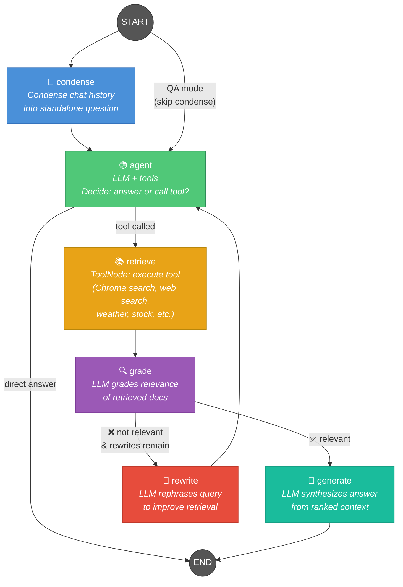
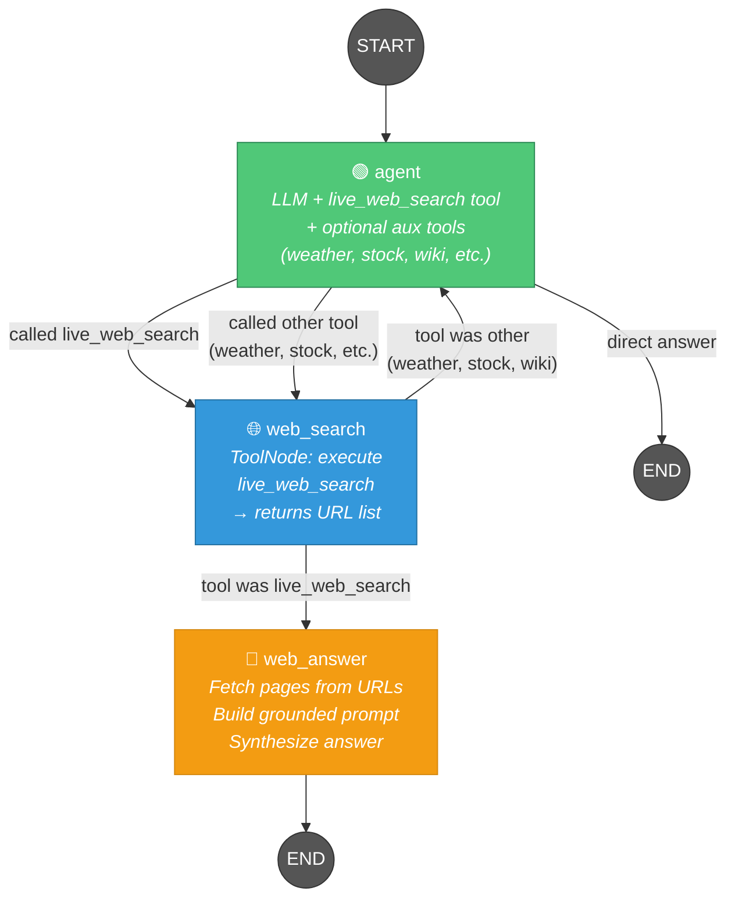
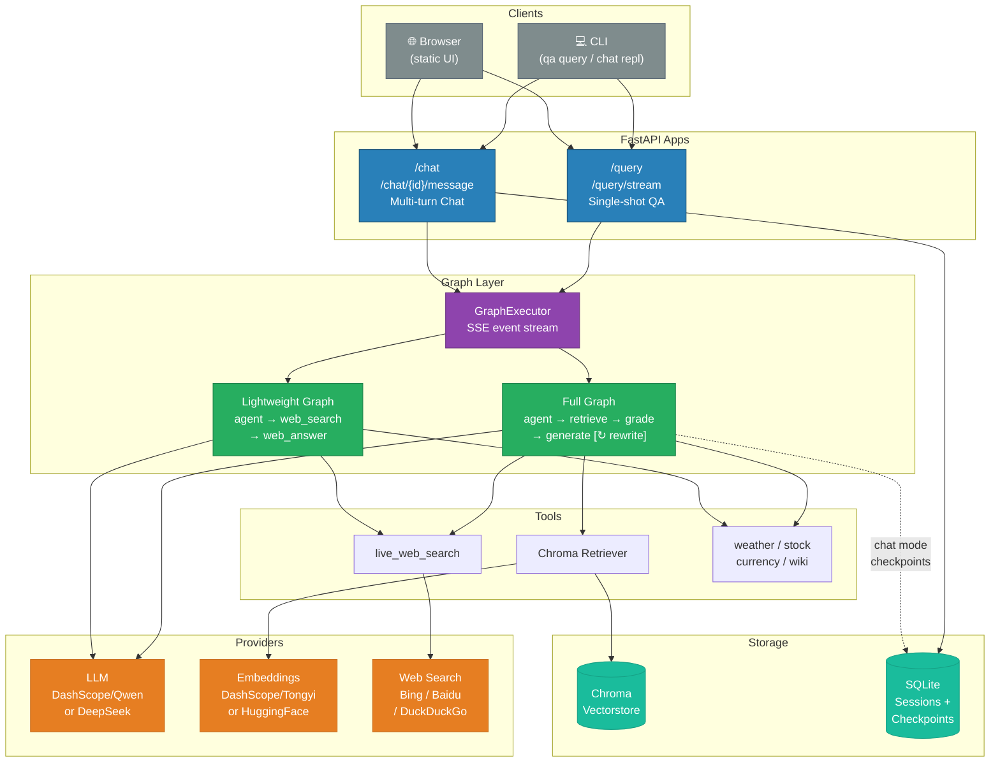
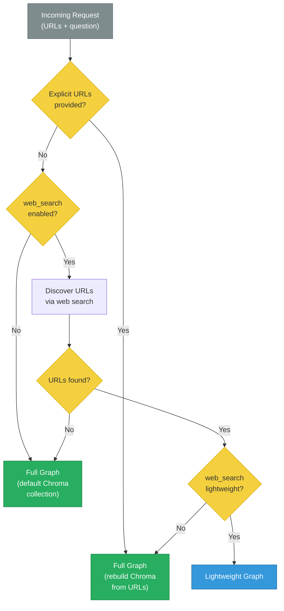
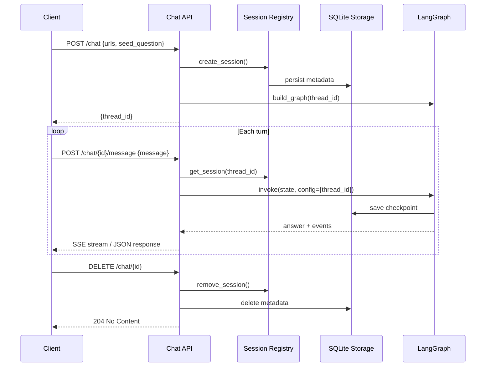

# LangGraph RAG — Workflow Diagrams

## 1. Full RAG Graph (`build_graph`)

Used for **QA** and **Chat** modes with Chroma vectorstore retrieval, document grading, and query rewriting.



### QA Mode (no condense)
```
START → agent → retrieve → grade → generate → END
                  ↑                    |
                  +—— rewrite ←———————+
```

### Chat Mode (with condense)
```
START → condense → agent → retrieve → grade → generate → END
                      ↑                    |
                      +—— rewrite ←———————+
```

### Edge Routing Logic

| Edge | Condition | Map |
|------|-----------|-----|
| `agent` → `retrieve` | Agent called a tool | `tools_condition()` → `"tools"` |
| `agent` → `END` | Agent answered directly | `tools_condition()` → `END` |
| `grade` → `generate` | Docs relevant OR rewrite budget exhausted | `GRADE_EDGE_MAP["generate"]` |
| `grade` → `rewrite` | Docs not relevant + budget remains | `GRADE_EDGE_MAP["rewrite"]` |
| `rewrite` → `agent` | Always (fixed edge) | — |

### Rewrite Loop
The `rewrite_count` in `RAGState` limits rewrites (default `max_rewrites=1`).
When the budget is exhausted, the graph forces `grade → generate` even if documents
are low-quality. The `allow_low_relevance_generate` setting also gates this.

---

## 2. Lightweight Graph (`build_lightweight_graph`)

Used when **web_search_lightweight** is enabled and sources were discovered via web search.
Skips Chroma, embeddings, grading, and rewriting entirely.



### Edge Routing Logic

| Edge | Condition | Map |
|------|-----------|-----|
| `agent` → `web_search` | Agent called any tool | `LIGHTWEIGHT_AGENT_EDGE_MAP["tools"]` |
| `agent` → `END` | Agent answered directly | `LIGHTWEIGHT_AGENT_EDGE_MAP[END]` |
| `web_search` → `web_answer` | Tool was `live_web_search` | `route_after_lightweight_tool()` → `"web_answer"` |
| `web_search` → `agent` | Tool was weather/stock/wiki/etc. | `route_after_lightweight_tool()` → `"agent"` |

### Auxiliary Tool Loop
When the agent calls a non-web-search tool (weather, stock, currency, Wikipedia), the
output routes back to `agent` so the LLM sees the structured result and synthesizes
a final answer. The `web_answer` node is only used for web page grounding.

---

## 3. System Architecture Overview



---

## 4. Tool Binding Matrix

Which tools are bound to the agent in each graph:

| Tool | Full Graph | Lightweight Graph | Requires Flag |
|------|:----------:|:-----------------:|:-------------:|
| Chroma Retriever | ✅ | ❌ | — |
| `live_web_search` | ✅ | ✅ | `web_search_enabled` |
| `get_weather` | ✅ | ✅ | `weather_enabled` |
| `get_stock_quote` | ✅ | ✅ | `stock_enabled` |
| `convert_currency` | ✅ | ✅ | `currency_enabled` |
| `search_wikipedia` | ✅ | ✅ | `wikipedia_enabled` |

---

## 5. Graph Selection Logic



---

## 6. Chat Session Lifecycle


